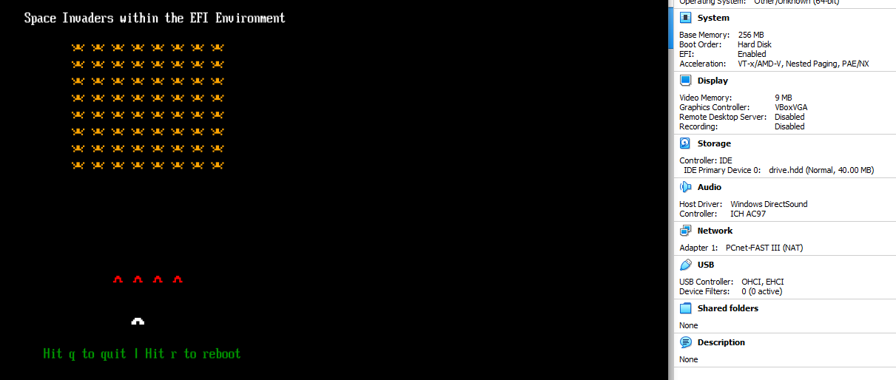

# UEFI based Bootable Space Invaders game

**DISCORD** : https://discord.gg/6gxEF3QCtB  

Still in development. Coming soon...  

The Unified Extensible Firmware Interface ( UEFI ) bootloader code I have written from scratch.  

Original 2.9 Specs PDF  
https://uefi.org/specifications  

The create image is there for your convenience. I include the EXE and source code. The exe creates the drive.hdd file you need to put your UEFI program onto. I designed it so it is already setup with a GPT / EFI partition. Make sure you put BOOTX64.EFI into EFI/BOOT/ folder. It MUST have those exact names and capitalizations. In otherwords, you must create the folders. So you will have to mount it. In Linux there are tools for this. But in windows, I use OSFMount to mount the drive.hdd file and then I copy the compiled BOOTX64.EFI onto it. The drive.hdd file boots in both QEMU and in VirtualBox.

MinGWx64 ( GCC )  
https://nuwen.net/mingw.html   ( This works in Windows. Cross-compiler is not needed. )  

OSFMount  
https://www.osforensics.com/tools/mount-disk-images.html  
**NOTE :** I have now included BAT files with the command line switches to use OSFMount without the GUI interface.  

Animated sprites already working.  

**TODO** : Game Logic, better Timer, Ship firing and movement.  

**Progress so far**  

